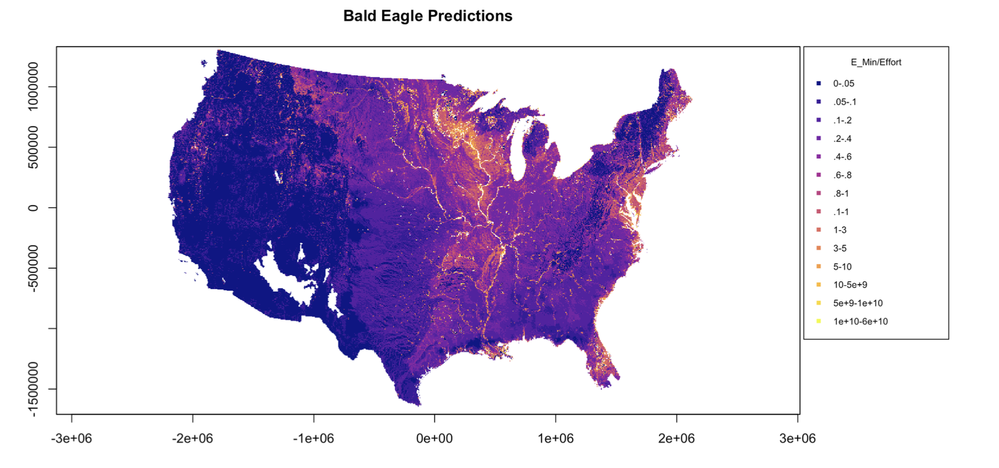
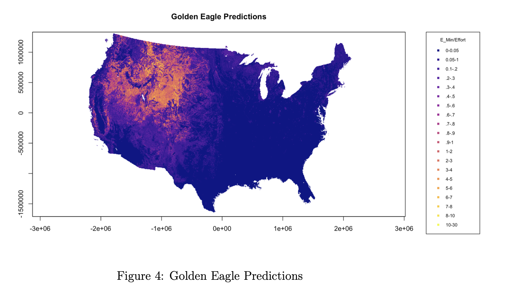
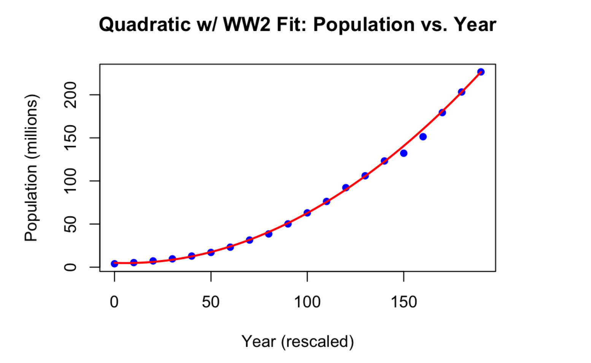
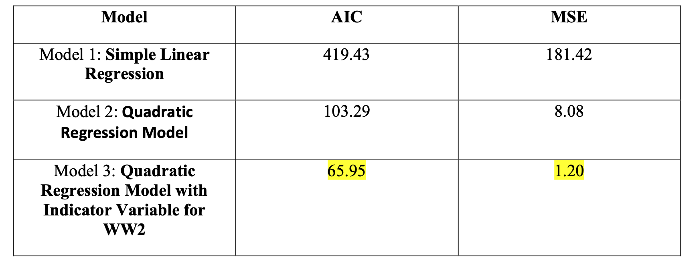
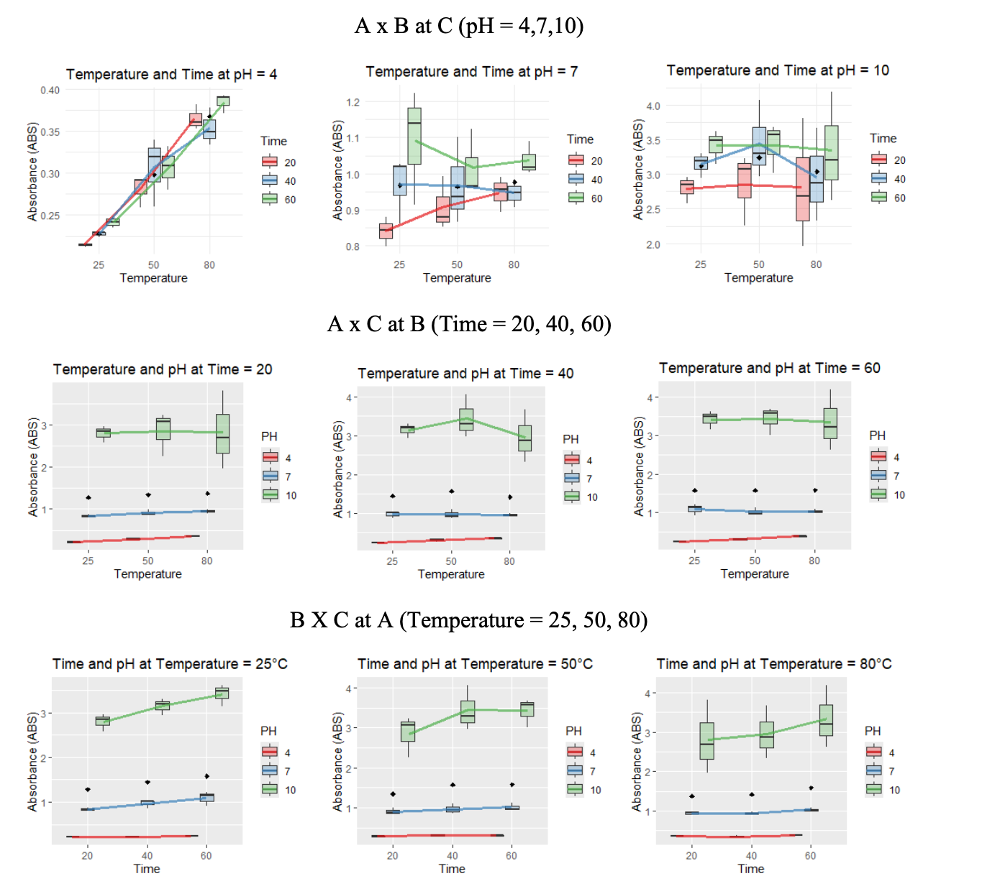
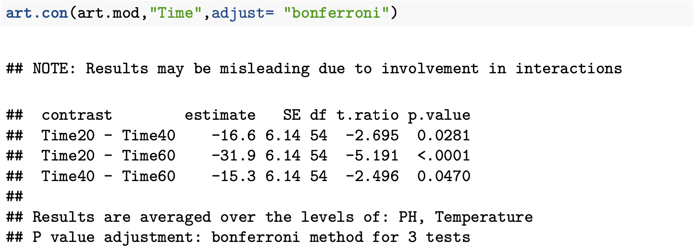

<!-- 
<table style="width:100%; border: none;">
<tr>
<td style="width: 160px; vertical-align: top;">
  
</td>
<td style="padding-left: 20px; vertical-align: middle;">
  <h1 style="margin-bottom: 5px;">Eugene Monforte</h1>
  
<strong>Statistics Master's Student</strong>

  
Cal Poly Pomona

  
<a href="https://github.com/EugeneMonforte/Portfolio">View Portfolio on GitHub</a>

  
📊 Statistician | 📈 Data Analyst | 🎓 Master's Student at Cal Poly Pomona

</td>
</tr>
</table>

-->

<table>
<tr>
<td width="160">
  
</td>
<td>
  <h1>Eugene Monforte</h1>
  
<strong>Statistics Master's Student</strong> 
  Cal Poly Pomona

  
<a href="https://github.com/EugeneMonforte/Portfolio">View Portfolio on GitHub</a>

</td>
</tr>
</table>

📊 Statistician | 📈 Data Analyst | 🎓 Master’s Student at Cal Poly Pomona

---

## 🔬 Projects

### 📁 Regression methods for constructing species distribution models for eagle-use in the continental United States
- Co-wrote a government report for the U.S. Fish and Wildlife Service detailing the results of the species distribution model developed during the REU that will be used to inform U.S. policy regarding the permitted take of eagles at terrestrial wind farms within the country
- Collaborated with government employees at the U.S. Fish and Wildlife Service to define the research question, obtain data and ensure the results would be relevant for integration with U.S. policy regarding the take of eagles at terrestrial wind facilities
- Gave an oral presentation of the species distribution model to collaborators in the U.S. Fish and Wildlife Service, highlighting how the results might be used to inform government policy
- Applied generalized additive mixed models (GAMMs) to country wide data on golden and bald eagle use, habitat characteristics, and weather covariates
- [View Report (PDF)](https://github.com/EugeneMonforte/Portfolio/blob/main/REU_Paper.pdf) | [View Poster (PDF)](https://github.com/EugeneMonforte/Portfolio/blob/main/Eagles%20Poster.pptx.pdf)

### 🦅 Bald Eagle Prediction

### 🦅 Golden Eagle Prediction

### 📁 Prediction of US Population Growth
- Analyzed Population Growth from Years 1790 to 1980 to predict 2020 US Population
- Used Quadratic Regression with an Indicator Variable
- Accurately Predicted 2020 population with less than 1% percent error 
- [View Report (PDF)](https://github.com/EugeneMonforte/Portfolio/blob/main/5900%20Individual%20Project.pdf) 

### Fit of Model

### Model Comparisons

### 📁 Assessment of the Stretch Composition Program
- Evaluation of multi-quarter English Composiiton program, assessing the effectiveness of the 1-, 2-, and 3-quarter course sequences using program data and student outcomes
- Methods stated would range from a variety of ANOVA techniques (one-way, two-way, repeated measure,
etc.), to t-test, chi-square testing and parametric and nonparametric method
- [View Report (PDF)](https://github.com/EugeneMonforte/Portfolio/blob/main/StretchComposition.pdf)

### 📁 Textile Dye
- Exploration of sustainable solutions in the agricultural sector through the repurposing of almond waste; investigated the use of almond extracts as functional textile dyes for apparel applications.
- Methods for the 3-way factorial design include parametric testing for ANOVA, and nonparametric testing using ART ANOVA.
-  [View Report (PDF)](https://github.com/EugeneMonforte/Portfolio/blob/main/TextileDye.pdf)

### 3-Way Interactions of Time, Temperature and pH

### Nonparametric ART ANOVA Summary Output

### ART Contrast Results for Time

### 📁 Survey Data Analysis
- Analysis of survey data related to student campus life at a state university, with emphasis on statistical techniques used to interpret student experiences and behaviors. 
- Methods: Chi Squared Test, Goodness of Fit Test, the Chi Squared Test of Independence and Z-Tests
-  [View Report (PDF)](https://github.com/EugeneMonforte/Portfolio/blob/main/SurveyData.pdf)

### 📂 Weather Forecast Dataset
- Exploring what weather factors have the biggest impact on the outcome of rain  
- Methods: Logistic Regression, Wald Test, Odds Ratio and Confidence Intervals for Odds Ratio  
- [View Report (PDF)](https://eugenemonforte.github.io/Portfolio/4700_Weather%20(4).pdf)

---

## 🎓 Education
**M.S. in Statistics**, Cal Poly Pomona  
(Expected Graduation: 2026)  
**B.S. in Applied Mathematics**, Cal Poly Pomona  
(Graduated: 2024)

---

## 📫 Contact
- [LinkedIn](your-link)
- Email: your-email@example.com

